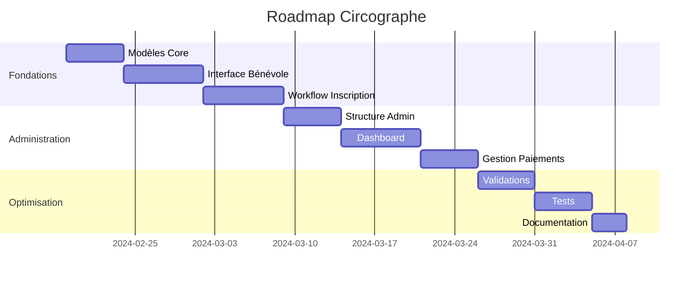
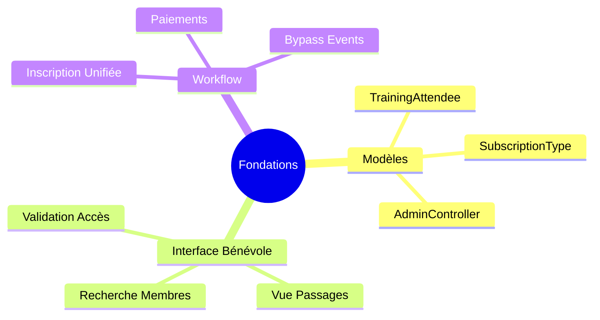
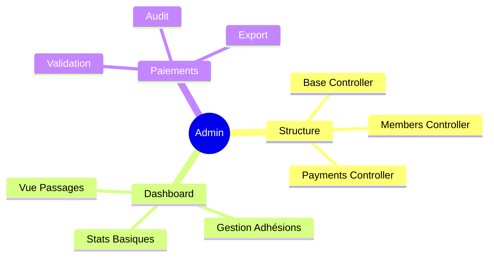
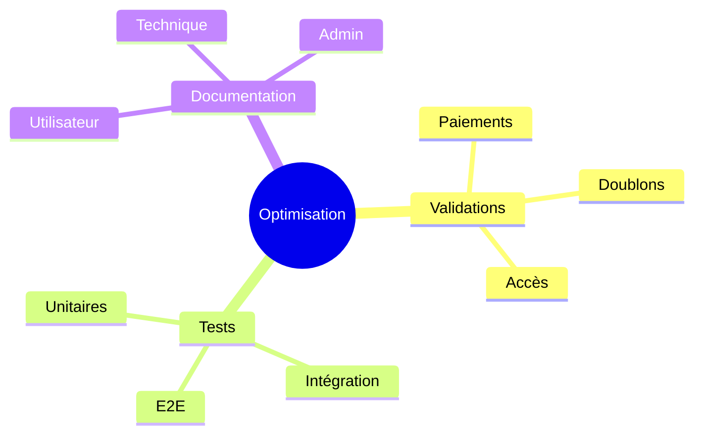

# Roadmap Circographe

```mermaid
gantt
    title Roadmap Circographe
    dateFormat  YYYY-MM-DD
    section Fondations
    Modèles Core           :2024-02-19, 5d
    Interface Bénévole     :2024-02-24, 7d
    Workflow Inscription   :2024-03-02, 7d

    section Administration
    Structure Admin        :2024-03-09, 5d
    Dashboard             :2024-03-14, 7d
    Gestion Paiements     :2024-03-21, 5d

    section Optimisation
    Validations           :2024-03-26, 5d
    Tests                 :2024-03-31, 5d
    Documentation         :2024-04-05, 3d
```

## Détails des Phases

### Phase 1 : Fondations (3 semaines)

```mermaid
mindmap
  root((Fondations))
    Modèles
      TrainingAttendee
      SubscriptionType
      AdminController
    Interface Bénévole
      Vue Passages
      Recherche Membres
      Validation Accès
    Workflow
      Inscription Unifiée
      Paiements
      Bypass Events
```

### Phase 2 : Administration (3 semaines)

```mermaid
mindmap
  root((Admin))
    Structure
      Base Controller
      Members Controller
      Payments Controller
    Dashboard
      Vue Passages
      Gestion Adhésions
      Stats Basiques
    Paiements
      Validation
      Audit
      Export
```

### Phase 3 : Optimisation (2 semaines)

```mermaid
mindmap
  root((Optimisation))
    Validations
      Paiements
      Doublons
      Accès
    Tests
      Unitaires
      Intégration
      E2E
    Documentation
      Technique
      Utilisateur
      Admin
``` 