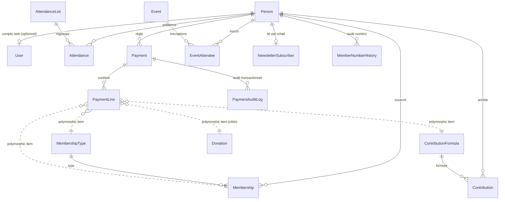
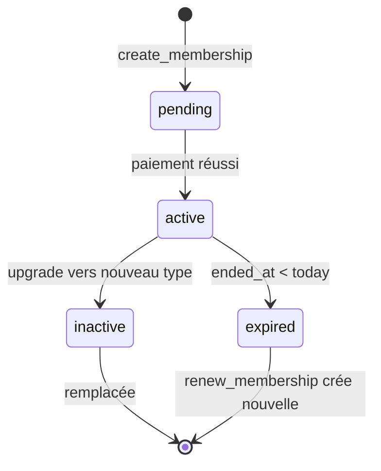
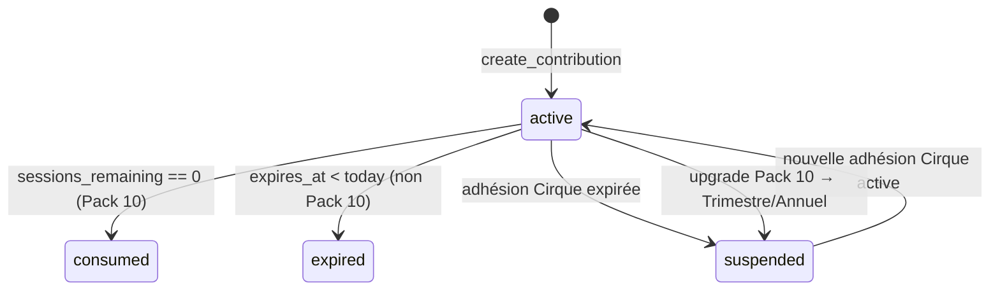
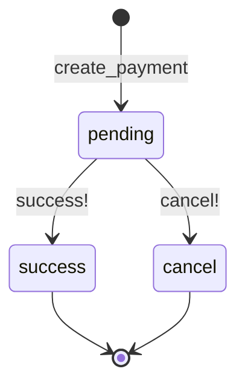
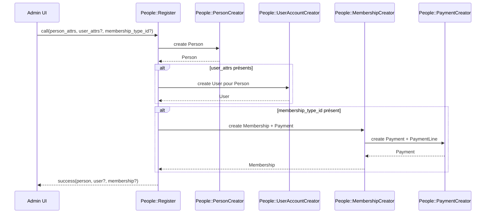

# Modèle de Domaine — Le Circographe

> **Statut** : stable
> **Public cible** : contributeur
> **Dernière vérification** : 2026-04-27
> **Sources de vérité** : `db/schema.rb`, `app/models/person.rb`, `app/models/membership.rb`, `app/models/payment.rb`, `app/models/payment_line.rb`.

> Vocabulaire utilisé : voir [glossary.md](glossary.md). Quand le code n'est pas encore aligné sur le vocabulaire cible, l'alias legacy est indiqué entre parenthèses.
> **Pattern** : Person-Based / DDD-light.

---

## 1. Vue d'ensemble

> **Légende** :
> - `Contribution` : code actuel `BookOfEntry` (rename planifié `phase3-model-rename`).
> - `ContributionFormula` : code actuel `SubscriptionPlan` (rename planifié `phase3-model-rename`).
> - `Donation` : pas encore matérialisé en modèle distinct ; dette legacy `item_type: "Payment"` à éliminer (voir [payments.md](payments.md)).

---

## 2. Responsabilités par agrégat

### 2.1 Personnes et comptes

#### `Person` — Aggregate Root CRM
- **Identité** : `full_name`, `phone`, `email`, `address`, `birth_date`.
- **Tarif réduit** : `reduced_rate_eligible`, `reduced_rate_reason`, `reduced_rate_proof`.
- **Soft delete** : `deleted_at` (concern `SoftDeletable`).
- **Méthodes métier** :
  - `Person#create_membership!(type, ...)` — adhésion + paiement + numéro d'adhérent.
  - `Person#upgrade_membership!(new_type, ...)` — plein tarif du nouveau type.
  - `Person#renew_membership!(...)` — nouvelle adhésion + nouveau numéro annuel.
  - `Person#create_contribution!(...)` (cible) / `Person#create_subscription!(...)` (legacy).
  - `Person#upgrade_contribution!(...)` (cible) / `Person#upgrade_subscription!(...)` (legacy).
  - `Person#archive!` / `Person#restore!`.
- **Garde-fou** : `has_financial_data?` empêche la suppression dure si l'historique financier est non vide.

#### `User` — Compte web (optionnel)
- **Authentification** : email, password, sessions, password_reset_token.
- **Rôle** : `system_role` enum `:super_admin | :admin | :volunteer | :web_visitor`.
- **Délégation** : `delegate :full_name, :phone, ... to: :person`.
- **Soft delete** : `User#archive!` (admin uniquement).

---

### 2.2 Adhésion

#### `Membership` — Contrat annuel
- **Lien** : `belongs_to :person`, `belongs_to :membership_type`.
- **Dates** : `started_at`, `ended_at` (1 an par défaut).
- **Statuts** : `:pending → :active → :inactive → :expired`.
- **Validations** : `ended_at > started_at`, pas d'overlap actif (sauf `skip_overlap_validation`).
- **Méthodes** : `#can_upgrade_to?(type)`, `#upgrade_to!(type, started_at)`, `#basic?`, `#circus?`.

#### `MembershipType` — Catalogue versionné
- **Champs** : `name`, `category` (`:basic | :circus | :event`), `price_cents`, `version`, `effective_from`, `effective_until`, `created_by_user_id`, `change_reason`.
- **Concern** : `Versionable`.

---

### 2.3 Cotisation (accès cirque)

#### `Contribution` (cible) / `BookOfEntry` (legacy) — Instance achetée
- **Lien** : `belongs_to :person`, `belongs_to :contribution_formula` (alias legacy : `subscription_plan`).
- **Champs** : `sessions_remaining` (Pack 10 uniquement), `purchased_at`, `expires_at`, `status`.
- **Statuts** : `:inactive | :active | :expired | :consumed | :suspended`.
- **Méthodes** :
  - `#can_use?` — vérifie adhésion Cirque active + sessions restantes.
  - `#use_session!` — décrémente `sessions_remaining` (Pack 10).
  - `#refund_session!` — recrédite (annulation présence).
  - `#suspend!(reason:)` / `#reactivate!`.
- **Note** : aujourd'hui ce modèle n'est exploité que pour les Pack 10 ; les durées Trimestre/Annuel/Day sont hors périmètre malgré la présence des champs. La phase 3 du plan de migration unifiera explicitement.

#### `ContributionFormula` (cible) / `SubscriptionPlan` (legacy) — Catalogue versionné
- **Champs** : `name`, `duration` enum (`:day | :trimester | :annual | :pack10`), `price_cents`, `sessions_count`, `validity_days`, `version`, `effective_from`, `effective_until`.
- **Méthode** : `.available_for(person)` — exige une adhésion Cirque active.

---

### 2.4 Paiements et dons

#### `Payment` — Transaction
- **Lien** : `belongs_to :person`, `belongs_to :recorded_by, class_name: "User"`.
- **Champs** : `total_cents`, `status` (`:pending | :success | :cancel`), `payment_method` (`:cash | :card | :cheque | :transfer | :offered`), `offer_reason`, `uuid`.
- **RGPD** : `Payment#anonymize!` (`person_id → NULL`, garde un hash de traçabilité).
- **Audit** : `PaymentAuditLog`.

#### `PaymentLine` — Ligne polymorphique
- **Champs** : `payment_id`, `item_type`, `item_id`, `amount_cents`, `description`.
- **Items canoniques** : `Membership`, `MembershipType`, `ContributionFormula` (legacy `SubscriptionPlan`), `Contribution` (legacy `BookOfEntry`), `Donation` (cible).
- **Invariant** : `payment.payment_lines.sum(:amount_cents) == payment.total_cents`.

#### `Donation` (cible)
- Pas encore un modèle distinct. Représenté actuellement par une `PaymentLine` avec `item_type: "Payment"` (réécriture par `People::PaymentCreator`). Migration en `phase1-donation-fix` (voir [payments.md](payments.md)).

---

### 2.5 Présences et événements

#### `Attendance`
- **Lien** : `belongs_to :person`, `belongs_to :attendance_list` (optionnel), `belongs_to :event` (optionnel), `belongs_to :contribution` (alias legacy `book_of_entry`).
- **Règles d'unicité** : `person_id + date` (entraînement libre) ou `person_id + event_id` (événement).
- **Effet de bord** : décrémente la cotisation utilisée si applicable.

#### `AttendanceList`
- **Statuts** : `:open | :close | :archived`.
- **Génération quotidienne** : `AttendanceListManagement::DailyListGenerator` (skip lundi).

#### `Event` & `EventAttendee`
- **Event** : `name`, `event_date`, `category` (default: `:circus`).
- **EventAttendee** : jointure `Person × Event` avec unicité `person_id + event_id`.

---

### 2.6 Audit et CRM

#### `MemberNumberHistory`
- Trace tout changement de numéro d'adhérent (`from_number`, `to_number`, `reason`, `changed_by`).

#### `PaymentAuditLog`
- Trace toute opération sur `Payment` (création, annulation, restauration, anonymisation).

#### `AccountClaim`
- Workflow de réclamation de compte : `:pending → :confirmed | :rejected | :expired` avec token sécurisé.

#### `NewsletterSubscriber`
- Table indépendante de `Person`. Lien automatique si l'email correspond.

---

## 3. Diagramme des cycles de vie

### 3.1 Adhésion

### 3.2 Cotisation (`Contribution`)

### 3.3 Paiement

---

## 4. Flux de création (orchestration `People::Register`)

---

## 5. Documents liés

- [glossary.md](glossary.md) — vocabulaire canonique.
- [payments.md](payments.md) — détail Payment / PaymentLine / Donation.
- [migrations/vocabulary_migration.md](migrations/vocabulary_migration.md) — mapping ancien → nouveau.
- [domain/business_logic.md](domain/business_logic.md) — règles métier complètes.
- [architecture/services.md](architecture/services.md) — services `People::*` et orchestrateurs.
