# Le Circographe - Documentation Technique

## Introduction

Le Circographe est une application de gestion administrative pour une salle d'entraînement de cirque. Elle permet aux bénévoles et administrateurs de gérer les adhésions et abonnements, et aux visiteurs de créer un compte et gérer leur inscription à la newsletter.

### Objectif Principal
Faciliter la gestion quotidienne d'un espace d'entraînement de cirque en centralisant :
- La création et gestion des adhésions (sur place uniquement)
- L'enregistrement des présences aux entraînements
- Le suivi des paiements et la comptabilité
- Les statistiques de fréquentation
- La communication avec les membres via newsletter

### Public Cible
- **Administrateurs** : Gestion complète de l'espace et des membres
- **Bénévoles** : Gestion des présences et inscriptions sur place
- **Membres** : Consultation de leur profil, historique et gestion newsletter
- **Visiteurs** : Création de compte, inscription newsletter et consultation des informations publiques

### Fonctionnalités Clés
1. **Interface Publique**
   - Création de compte en ligne
   - Gestion de l'inscription newsletter
   - Consultation des informations

2. **Interface Administrative**
   - Création de comptes membres
   - Gestion des adhésions et abonnements
   - Enregistrement des paiements sur place
   - Suivi des présences
   - Gestion des newsletters

3. **Types d'Adhésions** (gérées par admin/bénévole)
   - Adhésion basique (1€/an)
   - Adhésion cirque (10€/an, 7€ tarif réduit)
   - Système de réductions (étudiants, RSA, handicap)

4. **Produits d'Accès** (vendus sur place)
   - Pass journée (4€)
   - Carnet 10 séances (30€)
   - Abonnements trimestriel (65€) et annuel (150€)

5. **Outils de Gestion**
   - Dashboard administratif temps réel
   - Statistiques de fréquentation
   - Gestion financière
   - Rapports automatisés

6. **Interface Membre**
   - Consultation du profil
   - Visualisation des droits d'accès
   - Historique personnel
   - Téléchargement des documents

## 1. Architecture Globale

### 1.1 Vue d'ensemble
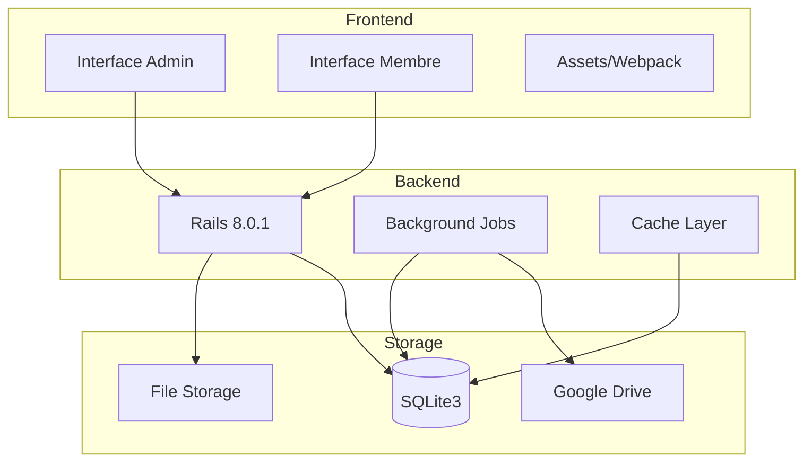

### 1.2 Flux de données
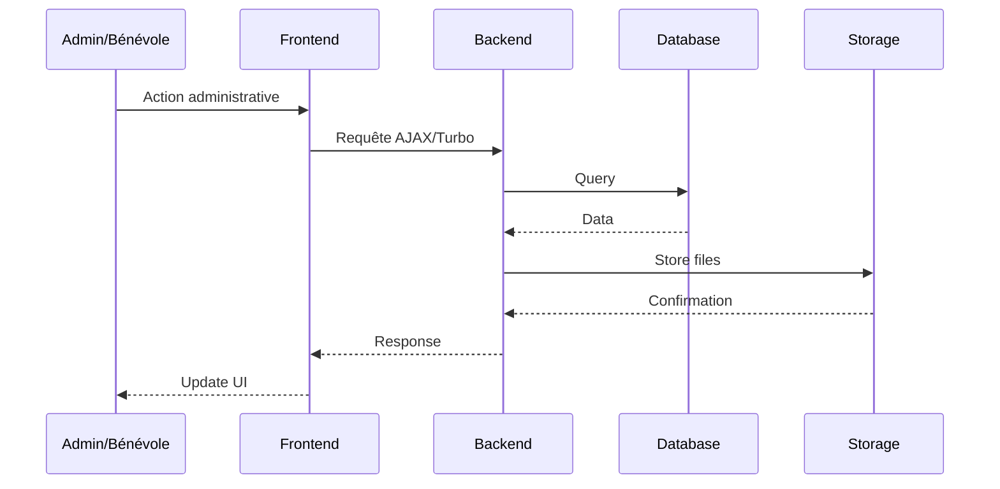

### 1.1 Stack Technique
- **Backend**: Ruby on Rails 8.0.1
- **Frontend**: 
  - Hotwire (Turbo + Stimulus)
  - Progressive Web App (PWA)
  - React (future implementation)
- **Base de données**: SQLite3
- **Déploiement**: Ionos VPS
- **Intégrations futures**:
  - HelloAsso API (gestion événements)
  - API JSON pour React

### 1.2 Points Techniques Clés
- PWA pour expérience mobile
- Architecture API-first pour future intégration React
- Système de rôles avec héritage de permissions
- Gestion de sessions quotidiennes automatisée

## 2. Modèle de Données

### 2.1 Structure Actuelle
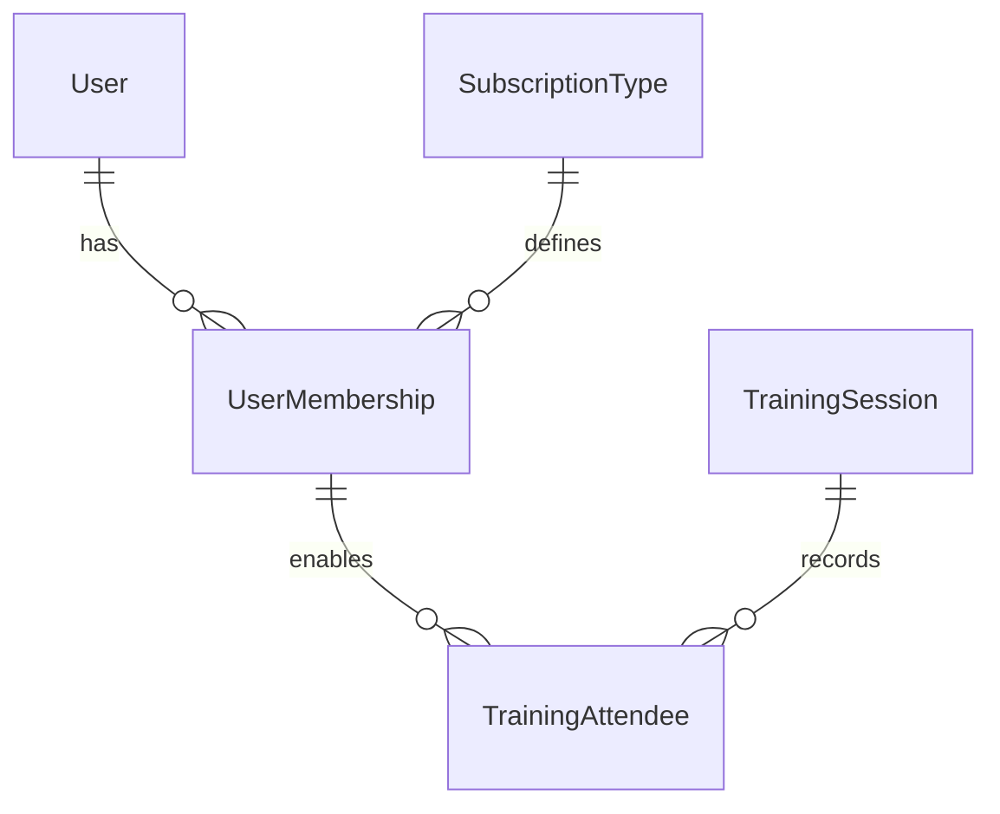

### 2.2 Évolution Proposée
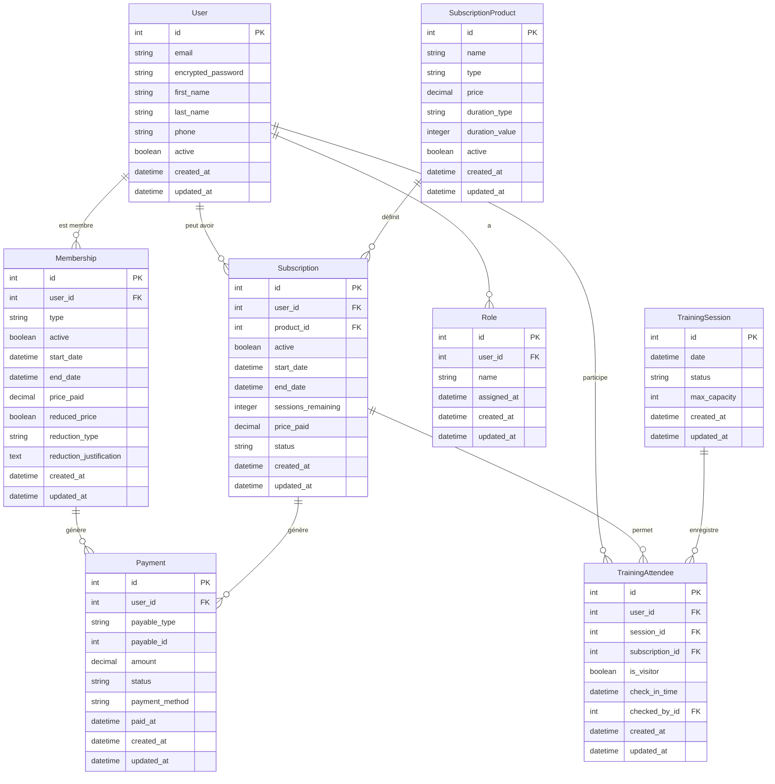

## 3. Logique Métier

### 3.1 Gestion des Membres

#### Statut de Membre
- **Adhésion Basique** (1€)
  - Donne accès aux événements
  - Permet d'être visiteur aux entraînements
  - Durée : 1 an

- **Adhésion Cirque** (10€/7€)
  - Inclut tous les avantages de l'adhésion basique
  - Permet l'achat d'abonnements pour la pratique
  - Tarif réduit possible (étudiant, RSA, handicap)
  - Durée : 1 an

#### Produits d'Accès à la Pratique
1. **Pass Journée** (4€)
   - Accès pour une journée
   - Nécessite une adhésion cirque valide

2. **Carnet 10 Séances** (30€)
   - 10 entrées
   - Validité : 6 mois
   - Nécessite une adhésion cirque valide

3. **Abonnement Trimestriel** (65€)
   - Accès illimité
   - Durée : 3 mois
   - Nécessite une adhésion cirque valide

4. **Abonnement Annuel** (150€)
   - Accès illimité
   - Durée : 1 an
   - Nécessite une adhésion cirque valide

### 3.2 Règles de Présence

#### Visiteurs
- Doit avoir une adhésion valide (basique ou cirque)
- Pas besoin d'abonnement
- Maximum 2 visites par an

#### Pratiquants
- Doit avoir une adhésion cirque valide
- Doit avoir un abonnement valide
- Le type d'abonnement détermine :
  - La durée d'accès (journée, trimestre, année)
  - Le nombre de séances (10 pour le carnet)

## 4. Flux de Données

### 4.1 Processus d'Adhésion
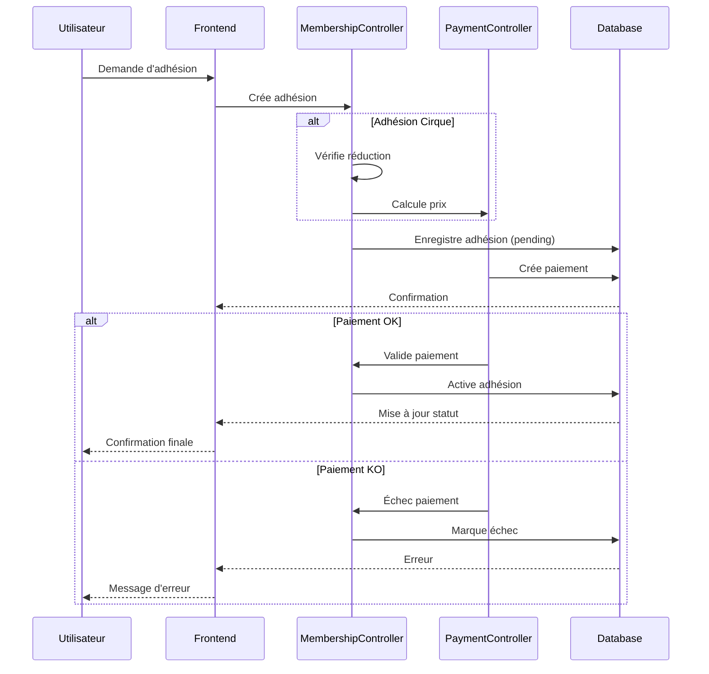

### 4.2 Gestion des Présences
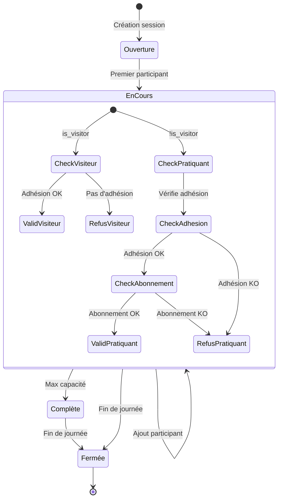

## 5. Sécurité et Accès

### 5.1 Rôles Utilisateurs
- **Membre** : Accès lecture seule
- **Bénévole** : Gestion des présences
- **Admin** : Toutes les fonctionnalités
- **Super Admin** : Configuration système

### 5.2 Authentification
- Devise pour l'authentification
- JWT pour l'API
- Sessions sécurisées

## 6. Système de Rapports et Archivage

### 6.1 Rapports Hebdomadaires
- Génération : Lundi 3h
- Format : PDF
- Destinataires : Admins
- Contenu :
  - Statistiques de présence
  - Nouveaux membres
  - Abonnements expirés/à renouveler
  - Statistiques financières

### 6.2 Sauvegardes
- Base de données : Quotidienne (2h)
- Documents : Hebdomadaire
- Archives : Mensuelle
- Stockage : Local + Google Drive
- Rétention : 5 ans

## 7. Points d'Attention

### 7.1 Évolution Base de Données
- Séparation possible membres/abonnements
- Migration progressive
- Préserver l'historique
- Tests approfondis nécessaires

### 7.2 Performance
- Indexation des requêtes fréquentes
- Cache pour les données statiques
- Optimisation des requêtes de présence

### 7.3 Maintenance
- Monitoring des erreurs
- Alertes automatiques
- Documentation à jour

## 8. Workflows Critiques

### 8.1 Gestion des Adhésions
```ruby
workflow :adhesion do
  state :initial
  state :en_attente_paiement
  state :active
  state :expiree

  event :payer do
    transitions from: :initial, to: :active
  end

  event :expirer do
    transitions from: :active, to: :expiree
  end
end
```

### 8.2 Paiements en Trois Fois
```ruby
workflow :paiement_trois_fois do
  state :initial
  state :premier_paiement
  state :deuxieme_paiement
  state :complete
  state :en_defaut

  event :premier_versement do
    transitions from: :initial, to: :premier_paiement
  end

  event :deuxieme_versement do
    transitions from: :premier_paiement, to: :deuxieme_paiement
  end

  event :finaliser do
    transitions from: :deuxieme_paiement, to: :complete
  end
end
```

### 8.3 Processus de Paiement en Trois Fois
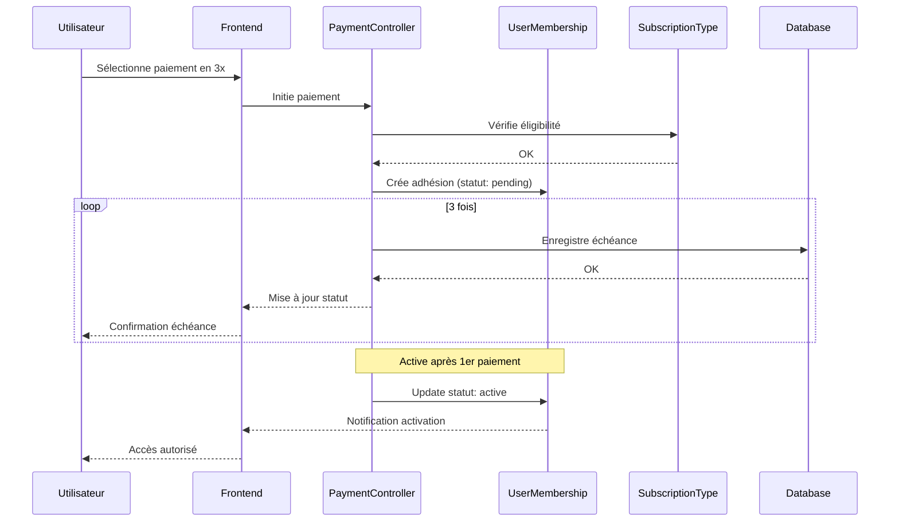

### 8.4 Architecture du Dashboard
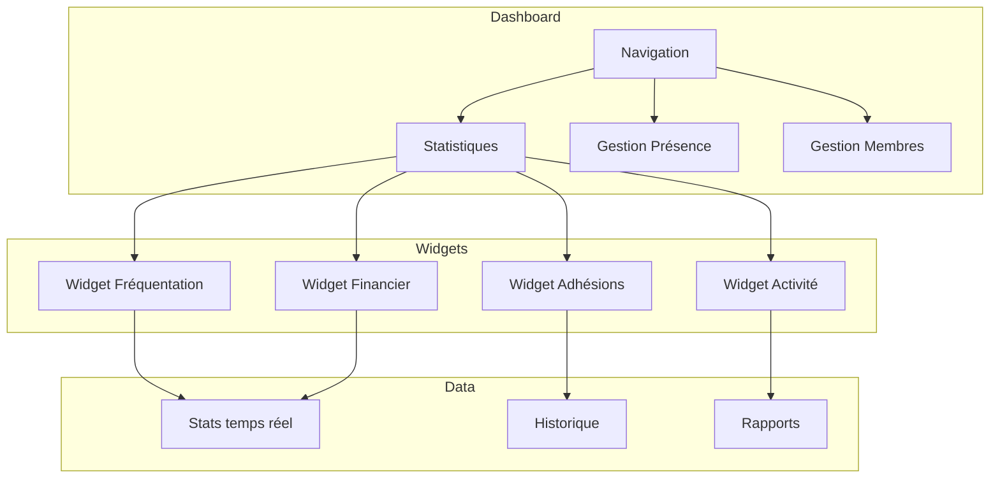

### 8.5 Déploiement
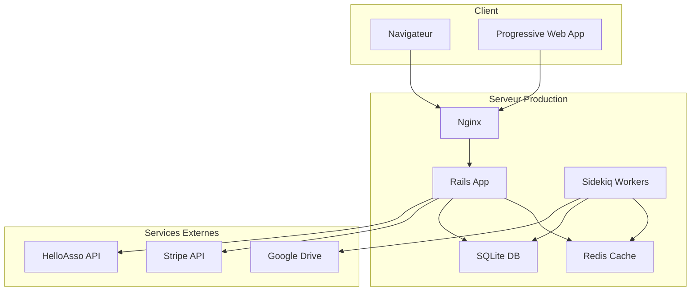

## 9. Sécurité et Permissions

### 9.1 Matrice des Droits
| Action                    | Guest | Member | Circus | Volunteer | Admin | Godmode |
|--------------------------|-------|---------|---------|-----------|--------|----------|
| Voir événements          | ✓     | ✓       | ✓       | ✓         | ✓      | ✓        |
| Gérer présences          | ✗     | ✗       | ✗       | ✓         | ✓      | ✓        |
| Gérer adhésions          | ✗     | ✗       | ✗       | ✓         | ✓      | ✓        |
| Voir statistiques        | ✗     | ✗       | ✗       | ✓         | ✓      | ✓        |
| Gérer admins             | ✗     | ✗       | ✗       | ✗         | ✗      | ✓        |

### 9.2 Validation des Actions
```ruby
def authorize_action(user, action)
  return false unless user.present?
  return true if user.godmode?
  
  case action
  when :manage_admins
    user.godmode?
  when :manage_members
    user.admin? || user.volunteer?
  when :view_statistics
    user.admin? || user.volunteer?
  else
    false
  end
end
```

## 10. Points d'Attention

### 10.1 Performance
- Optimisation des requêtes statistiques
- Cache pour données fréquemment accédées
- Indexation stratégique

### 10.2 Maintenance
- Sauvegarde quotidienne
- Monitoring des paiements
- Logs d'activité admin

### 10.3 Évolution
- Préparation API JSON
- Structure pour HelloAsso
- Migration future vers React

### 10.3 PWA et Mobile

#### 10.3.1 Fonctionnalités Hors-ligne
- **Consultation**
  - Profil utilisateur
  - Carte de membre
  - Historique personnel
  - Abonnements actifs
- **Mise en cache**
  - Dernières présences
  - Documents personnels
  - Planning des sessions

#### 10.3.2 Notifications Push
- **Configuration**
  - Préférences par utilisateur
  - Horaires programmés (12h par défaut)
  - Notifications urgentes (24/7)
  - Gestion des abonnements

- **Types**
  - **Administratives**
    - Rappels renouvellement
    - Confirmations paiement
    - Validations présence
    - Changements statut
  - **Informatives**
    - Changements horaires (opt-in admin)
    - Événements importants
    - Maintenance prévue
    - Actualités

- **Gestion**
  - Interface admin dédiée
  - Prévisualisation
  - Programmation
  - Historique d'envoi

#### 10.3.3 Sauvegardes et Sécurité
- **Sauvegardes**
  - Quotidiennes (BDD complète)
  - Hebdomadaires (système complet)
  - Mensuelles (archives)
  - Vérification automatique

- **Restauration**
  - Procédure documentée
  - Tests réguliers
  - Points de restauration
  - Migration assistée

- **Sécurité**
  - Chiffrement des données
  - Accès restreint
  - Audit des accès
  - Monitoring 24/7 

### 2.1 Modèle de données
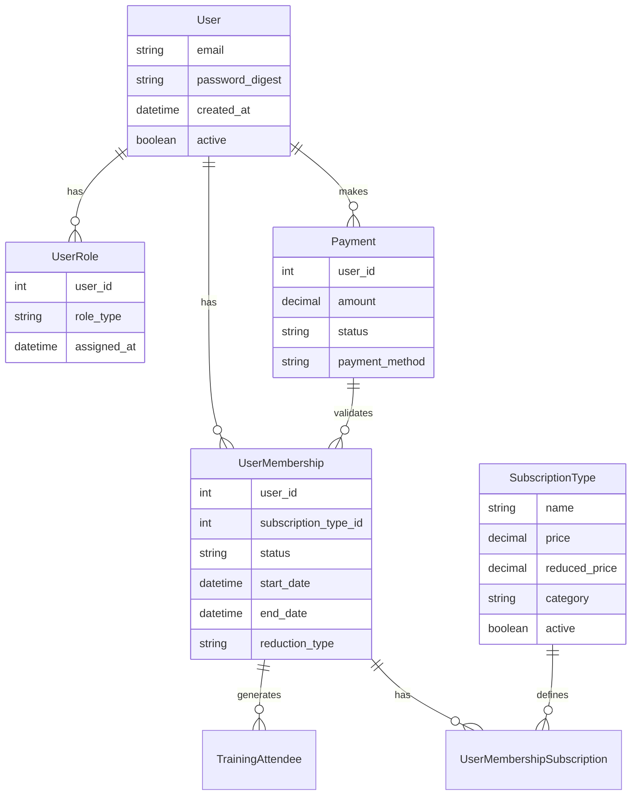

### 2.2 Workflow des adhésions
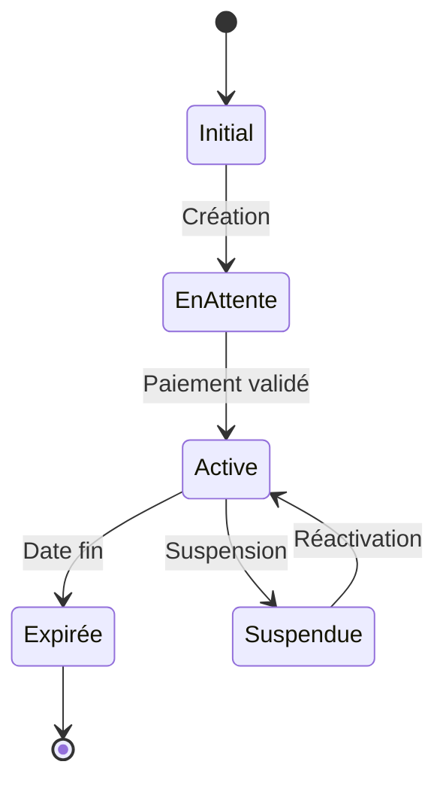

## 11. API REST

### 11.1 Points d'Entrée Principaux

#### Authentification et Compte
```
POST   /api/v1/auth/register
POST   /api/v1/auth/login
POST   /api/v1/auth/logout
POST   /api/v1/auth/refresh
```

#### Newsletter
```
POST   /api/v1/newsletter/subscribe
POST   /api/v1/newsletter/unsubscribe
GET    /api/v1/newsletter/status
```

#### Membres
```
GET    /api/v1/members
POST   /api/v1/members
GET    /api/v1/members/:id
PATCH  /api/v1/members/:id
DELETE /api/v1/members/:id
```

#### Adhésions
```
GET    /api/v1/memberships
POST   /api/v1/memberships
GET    /api/v1/memberships/:id
PATCH  /api/v1/memberships/:id
```

#### Abonnements
```
GET    /api/v1/subscriptions
POST   /api/v1/subscriptions
GET    /api/v1/subscriptions/:id
PATCH  /api/v1/subscriptions/:id
```

#### Présences
```
GET    /api/v1/training_sessions
POST   /api/v1/training_sessions
GET    /api/v1/training_sessions/:id/attendees
POST   /api/v1/training_sessions/:id/attendees
DELETE /api/v1/training_sessions/:id/attendees/:attendee_id
```

### 11.2 Format des Réponses

#### Succès
```json
{
  "status": "success",
  "data": {
    // données de la réponse
  },
  "meta": {
    "page": 1,
    "per_page": 20,
    "total": 100
  }
}
```

#### Erreur
```json
{
  "status": "error",
  "error": {
    "code": "INVALID_MEMBERSHIP",
    "message": "L'adhésion n'est pas valide",
    "details": {
      // détails supplémentaires
    }
  }
}
```

### 11.3 Sécurité API

#### Authentication
- JWT (JSON Web Tokens)
- Refresh Tokens
- CORS configuré pour les domaines autorisés

#### Rate Limiting
- 1000 requêtes/heure pour les clients authentifiés
- 60 requêtes/heure pour les clients non authentifiés
- Headers pour le suivi des limites

#### Versioning
- Version dans l'URL (/api/v1/...)
- Support des anciennes versions pendant 6 mois
- Documentation des changements breaking

### 11.4 Webhooks

#### Événements Disponibles
```
member.created
member.updated
membership.activated
membership.expired
subscription.created
subscription.renewed
payment.succeeded
payment.failed
training.registered
training.cancelled
```

#### Format des Webhooks
```json
{
  "event": "membership.activated",
  "timestamp": "2024-01-27T01:31:00Z",
  "data": {
    // données de l'événement
  }
}
``` 